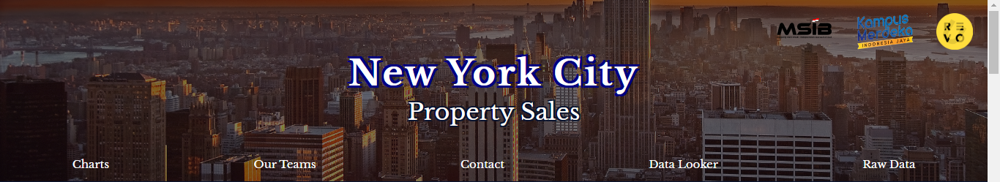
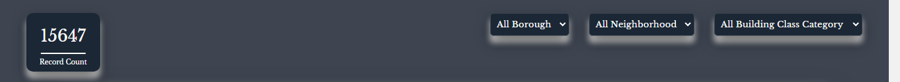
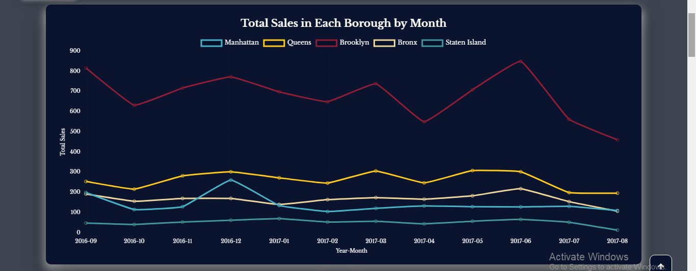
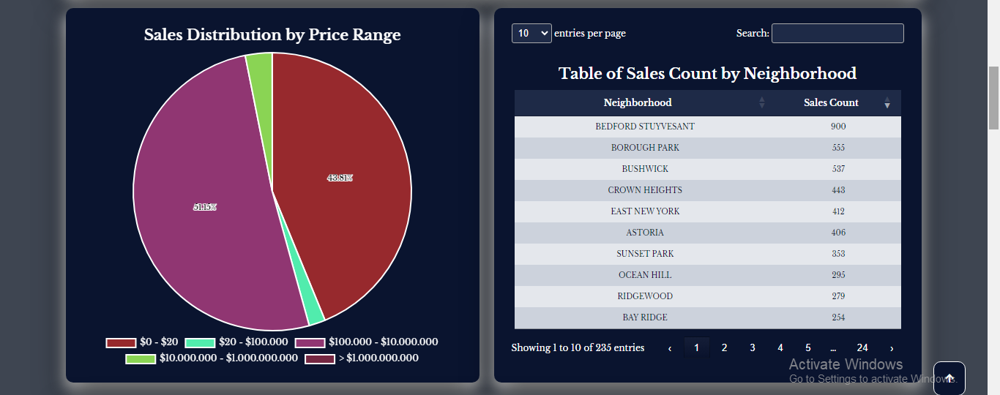
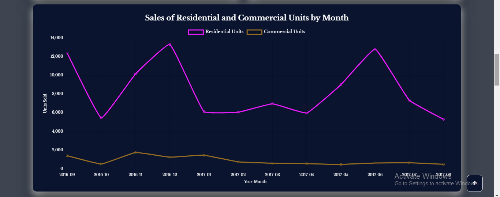
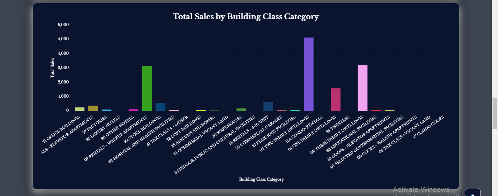
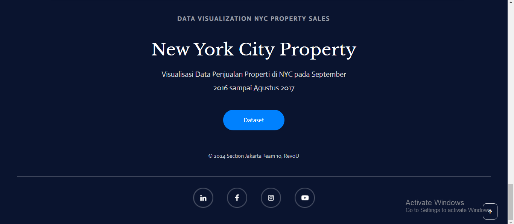

# New York Property Sales

## Description
This project is a capstone project from Revou, aiming to provide a comprehensive New York property sales report dashboard for analysis purposes.

## Usage
To use the dashboard, follow these steps:

1. Open the dashboard in your web browser.
2. Explore the different visualizations and filters.

## Features
- Interactive visualizations
- Filtering options
- Responsive design

## Screenshots
- Header

- Record Count and Filters

- Dashboard

- Member Team 10

- Footer

## Demo
Check out the live demo [here](https://km-feb24-jakarta-10.vercel.app/).

## Contributing
1. Fork the repository.
2. Create a new branch (`git checkout -b feature`)
3. Make changes and commit them (`git commit -am 'Add new feature'`)
4. Push to the branch (`git push origin feature`)
5. Create a new Pull Request.

## Credits
- Chart.js for data visualization
